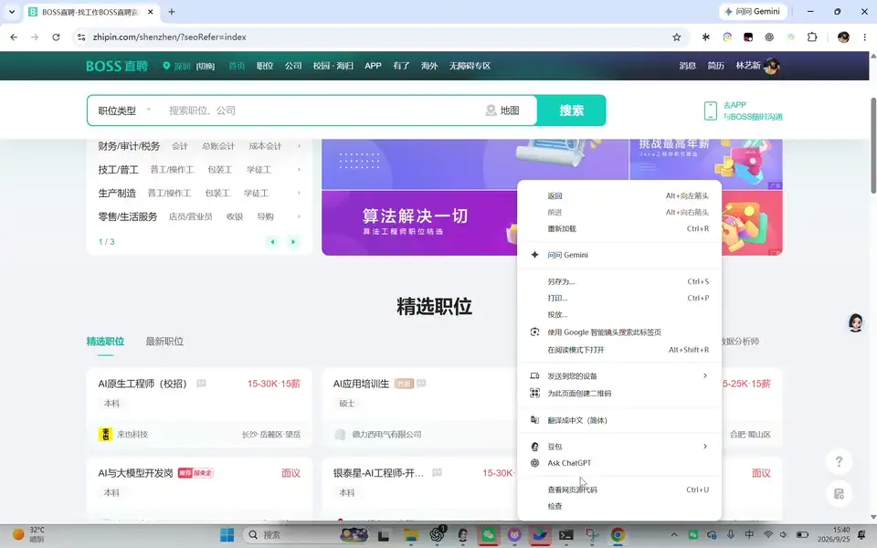
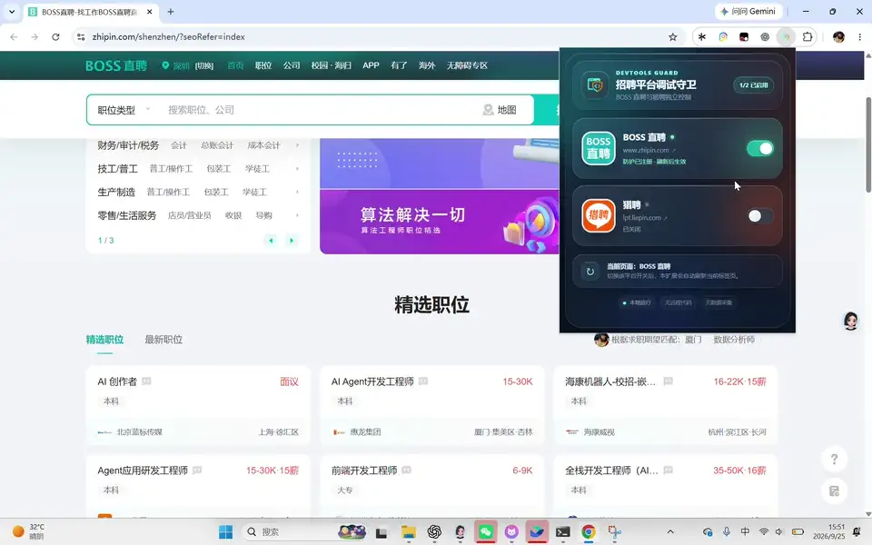

# BOSS DevTools Guard

这是一个仅作用于 `https://www.zhipin.com/*` 的 Chrome Manifest V3 解压扩展。它在 `document_start`、页面 `MAIN` world 中运行，用于阻止已经确认的 DevTools 检测和页面破坏链。

当前版本：`1.1.0`

## 页面表现对比

### 未启用扩展



上图记录未启用本扩展时，在 BOSS 直聘网页打开 F12 开发者工具后的页面表现。

### 启用扩展



上图记录启用本扩展后，BOSS 直聘网页可在 F12 开发者工具保持打开时正常浏览，已确认的反调试页面破坏链不再触发。

## 覆盖的页面链路

- SEO 页面：阻止生产脚本通过 `parent.__xbcw` 取得隐藏 iframe 的干净执行环境。
- SPA 职位页：阻止 `zhipin-geek-spa` 的 `noDebug` 模块通过闭包保存的空白隐藏 iframe `contentWindow` 取得未包装的原生 `console`。
- 仅过滤带有明确反调试形状的 Date、Function、RegExp、DOM getter 和 50×500 性能探针；普通 `console.log`、`console.table` 原样放行。
- 页面收不到 F12、Ctrl/Cmd+Shift+I/J/C、Ctrl/Cmd+U/S 事件，但扩展不调用 `preventDefault()`，Chrome 仍可正常打开 DevTools。
- 二次防线只拦截来自已确认 BOSS bundle、无用户手势的空 `_self` 打开、关闭、后退、清空 body、空地址导航和整页隐藏样式。

## 首次安装

1. 打开 `chrome://extensions/`。
2. 开启右上角“开发者模式”。
3. 点击“加载已解压的扩展程序”。
4. 选择本目录（必须是直接包含 `manifest.json` 的 `extension` 文件夹）。
5. 回到 BOSS 页面并刷新。

## 从 1.0.0 更新到 1.1.0

文件已经在原目录更新，不需要重新选择文件夹：

1. 打开 `chrome://extensions/`。
2. 找到 **BOSS DevTools Guard**，点击卡片上的“重新加载”按钮。
3. 回到 BOSS 职位页，按 `Ctrl+Shift+R` 强制刷新一次。
4. 确认扩展卡片或弹窗显示版本 `1.1.0`、状态为“已启用”。

## 验证和诊断

在 BOSS 页面控制台运行：

```js
window.__BOSS_DEVTOOLS_GUARD__?.getStatus()
```

正常应返回一个对象。在 SPA 职位页刷新并运行一段时间后，`cleanRealmEscapesBlocked` 或 `consoleProbesBlocked` 通常会增加。计数只保存在当前页面内，不持久化、不发送。

项目级自动验证：

```powershell
node ..\verify-production.mjs
node ..\verify-extension.mjs
```

## 权限与边界

- 主机权限只有 `https://www.zhipin.com/*`。
- 不读取 Cookie、密码、Local Storage、职位数据或聊天内容。
- 不处理登录、验证码、账号风控或业务 API。
- 不包含远程代码、分析 SDK 或数据上报。
- 普通 iframe 不受影响；SPA 修复只命中 BOSS bundle 调用栈下、直接挂到 body、无 `src/srcdoc/name/id/class` 且 `display:none` 的空白 iframe。

## 回滚

在扩展弹窗关闭开关，或在 `chrome://extensions/` 中停用/移除扩展，然后刷新 BOSS 页面。

## 已知限制

- 依赖 Chrome 102+ 的动态 `MAIN` world 内容脚本注册。
- BOSS 若再次更换域名、bundle 结构或检测方式，需要重新验证。
- 直接对 `location.href = ""` 的原生 setter 做全局重写风险较高，因此未覆盖；当前主防线会在反应函数执行前消除已确认的探针信号。
